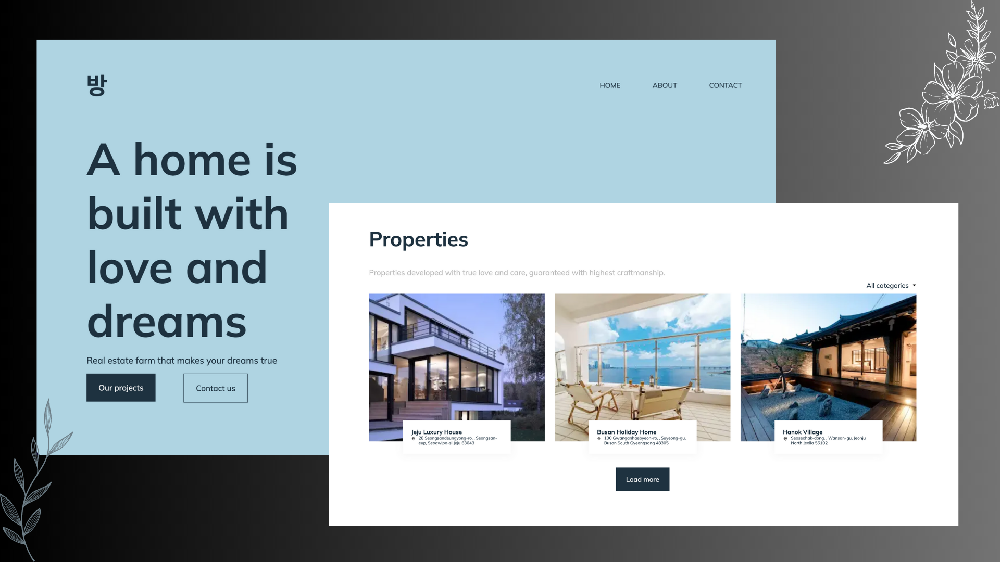
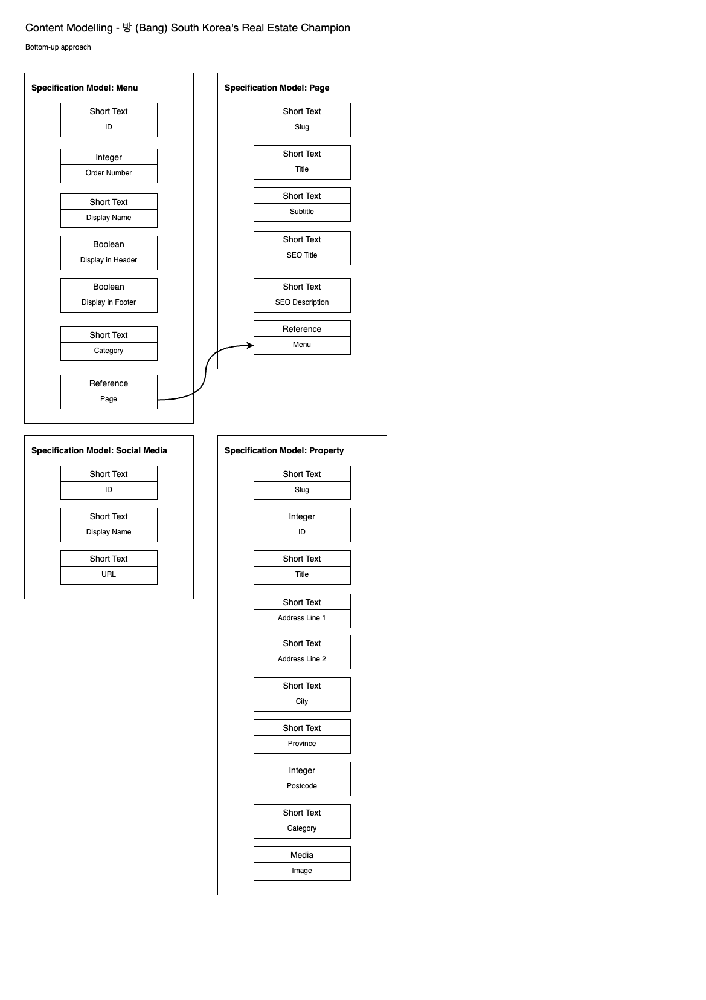

# Nextjs, TailwindCSS, Typescript, GraphQL/Apollo Client

Bang (방) is an award winning real estate company based in South Korea. Website is developed by Jane Valencia.

Disclaimer: The design is a mock-up.



## Background

The task involves turning the web design into a website using React (any framework of your choice), HTML5, CSS3, and Javascript.

The source data is fetched from a Headless CMS, Contentful. The API request is to be called using GraphQL API endpoint.

### Content Modeling Diagram



## Technology

- React: Next.js
- Node >= 18.13.0 & React >= 18
- TailwindCSS
  - @tailwindcss/typography
- Typescript
- @next/font plugin (default = Montserrat)
- Apollo-Client >= 3.7.9
- GraphQL >= 16.6.0
- deepmerge
- lodash
  - @types/lodash
- react-markdown
- Contentful (Headless CMS)
- Netlify Form

## Install

1. Copy this repository to your local
2. Run `yarn` or `npm install` from your terminal to install all dependencies.
3. Check out `env.example` file to guide you as to what credentials you need to connect to Contentful CMS and fetch data using Apollo Client.

## Development

### To run local server:
```
yarn dev
```

### To run ES lint:
```
yarn lint
```

### To build:
```
yarn build

yarn start
```
Note: The build folder will be in `.next` folder.

### Deployment

The site is deployed to [Netlify](https://www.netlify.com/). Refer to the Project About to access the production site.